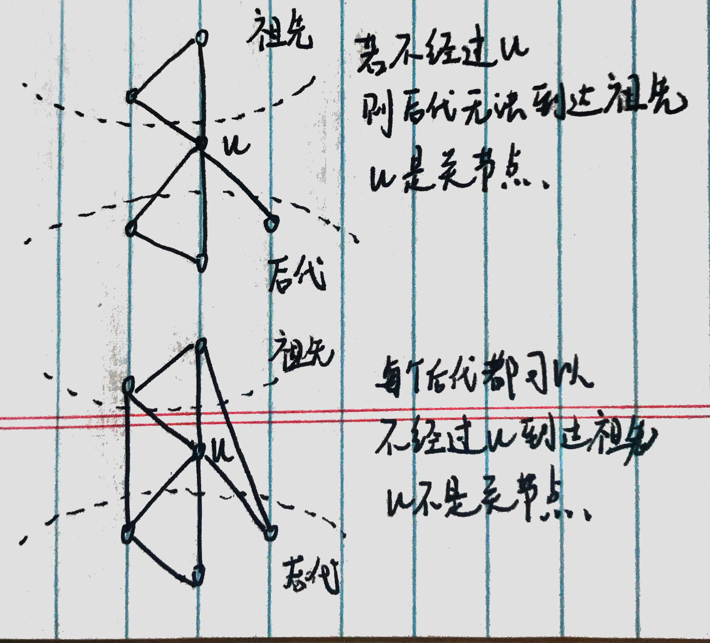

找图的关节点的思路：

* 简单思路： 尝试删除点，看看删后图是否连通 O(V*(V+E))
1) For every vertex v, do following
.a) Remove v from graph
.b) See if the graph remains connected (We can either use BFS or DFS)
.c) Add v back to the graph


* 高效思路 ：O(V+E)
* 可以理解为点u将图分为两部分，将其中一部分为u的祖先，另一部分为u的后代
* 若后代没有一条不经过u的边(称之为back edge)能连接u的任何一个祖先，则u是关节点
* 特别的，当u是根节点(或是我们第一个访问的点)，u没有祖先的时候，若u有超过两个子树(不是子节点，比如三个点两两相连，u有两个子节点但u不是关节点)，则u是关节点



算法： DFS
* 初始化parent为-1
* 对图的每一个点，若该点未访问，从该点进行DFS

DFS:
* 将当前点u标记为已访问，
* 初始化当前点u的disc和low的值为++time访问时刻
* 记录当前点u的子树个数 child=0
* 对于u点的每个邻接点
  * 若该点v未被访问，点v为u的后代
    * 说明此分支代表u的一颗新子树，child++
    * 设置该点v的parent为u，从点v进行DFS
    * DFS后 low[v]的值会变化， 若v能连接到u的祖先，说明low[v] < low[u]，为保持low[u]的正确性，需要low[u]  = Math.min(low[u], low[v]);
    * 判断u是否为关节点：
      * 若u是根，且u有超过两个子树，u是关节点
      * 若u不是根，且 low[v] >= disc[u] (u的child v不能经back edge到达u的祖先，或有回边但只到达u)则u是关节点
 
  * 若u的邻接点v已被访问过且v点不是u的父节点，则此分支可能是u祖先或u的后代，
    * 若为u的祖先，则 disc[v] 很可能小于 low[u]，意味着u有回边到达v，为保持low[u]的正确性，low[u]  = Math.min(low[u], disc[v]);
    * 若为u的后代，则 disc[v] 肯定大于 low[u]，low[u]  = Math.min(low[u], disc[v])=low[u] 不影响结果
    
    
* time 记录每个点的访问时刻，将此作为划分祖先和后代的依据
* disc[] 记录每个点被discover的时间time
* low[] 每个点出发向后经过back edge或经过其child的back edge能到达的最早访问的点，默认值为low[] = disc[]当前发现时间
* visited[] 记录每个点是否被discover过
* parent[] 记录每个点的父节点(最近祖先)
* ap[] 存放结果，记录每个点是否是关节点
 

```
import java.util.Iterator;
import java.util.LinkedList;

public class Graph{
    // number of vertices
    private int V;
    // Array  of lists for Adjacency List Representation
    private LinkedList<Integer> adj[];
    //the time when we visit each node
    int time = 0;

    // Constructor
    Graph(int v)
    {
        V = v;
        adj = new LinkedList[v];
        for (int i=0; i<v; ++i)
            adj[i] = new LinkedList();
    }

    //Function to add an edge into the graph
    void addEdge(int v, int w)
    {
        adj[v].add(w);  // Add w to v's list.
        adj[w].add(v);    //Add v to w's list
    }

    void dfs(int u, boolean visited[], int disc[], int low[], int parent[], boolean ap[])
    {
        // Mark the current node as visited
        visited[u] = true;
        // Count of subtree of current node
        int children = 0;
        // Initialize discovery time and low value
        disc[u] = low[u] = ++time;
        // Go through all vertices adjacent to current u
        Iterator<Integer> i = adj[u].iterator();
        while (i.hasNext())
        {
            int v = i.next();  // v is current adjacent of u
            // If v is not visited yet, means u have a new subtree
            // in DFS tree and recur for it
            if (!visited[v])
            {
                children++;
                parent[v] = u;
                dfs(v, visited, disc, low, parent, ap);
                // Check if the subtree rooted with v has a connection to one of the ancestors of u
                low[u]  = Math.min(low[u], low[v]);
                // u is an articulation point in following cases
                // (1) u is root of DFS tree and has two or more subtree.
                if (parent[u] == -1 && children > 1)
                    ap[u] = true;
                // (2) If u is not root and
                // one of its child cannot reach the node earlier than u through the back edge
                if (parent[u] != -1 && low[v] >= disc[u])
                    ap[u] = true;
            }
            // Update low value of u for parent function calls.
            else if (v != parent[u])
                low[u]  = Math.min(low[u], disc[v]);
        }
    }

    // The function to do DFS traversal. It uses recursive function APUtil()
    void findAP()
    {
        // whether the node is visited
        boolean visited[] = new boolean[V];
        // when we visited the node
        int disc[] = new int[V];
        // the earliest node we can reach from current node through it's (or it's child's) back edge
        int low[] = new int[V];
        //the parent of each node
        int parent[] = new int[V];
        // if the node is ap
        boolean ap[] = new boolean[V];

        // Initialize parent and visited, and ap(articulation point)
        // arrays
        for (int i = 0; i < V; i++)
        {
            parent[i] = -1;
            visited[i] = false;
            ap[i] = false;
        }

        // Call the recursive helper function to find articulation
        // points in DFS tree rooted with vertex 'i'
        for (int i = 0; i < V; i++)
            if (visited[i] == false)
               dfs(i, visited, disc, low, parent, ap);

        // Now ap[] contains all articulation points
        for (int i = 0; i < V; i++)
            if (ap[i] == true)
                System.out.print(i+" ");
    }

    // Driver method
    public static void main(String args[])
    {
        // Create graphs given in above diagrams
        System.out.println("Articulation points in first graph ");
        Graph g1 = new Graph(6);
        g1.addEdge(1, 0);
        g1.addEdge(0, 2);
        g1.addEdge(2, 1);
        g1.addEdge(2, 3);
        g1.addEdge(3, 4);
        g1.addEdge(2, 4);
        g1.addEdge(2, 5);
        g1.findAP();
        System.out.println();

        System.out.println("Articulation points in Second graph");
        Graph g2 = new Graph(4);
        g2.addEdge(0, 1);
        g2.addEdge(1, 2);
        g2.addEdge(2, 3);
        g2.findAP();
        System.out.println();

        System.out.println("Articulation points in Third graph ");
        Graph g3 = new Graph(7);
        g3.addEdge(0, 1);
        g3.addEdge(1, 2);
        g3.addEdge(2, 0);
        g3.addEdge(1, 3);
        g3.addEdge(1, 4);
        g3.addEdge(1, 6);
        g3.addEdge(3, 5);
        g3.addEdge(4, 5);
        g3.findAP();
    }
}
```
